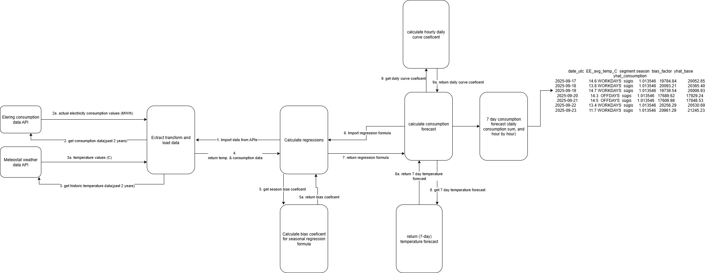

# Final Project: Electricity Consumption Forecast

## About the Final Project  
- This is the final project of the **Vali-IT Data Analytics 6-week bootcamp**: [vali-it.ee/andmetarkus](https://vali-it.ee/andmetarkus)  
- **Tech stack**: Python, Visual Studio Code, Jupyter Notebook, Git, GitHub  
- **Project authors**:  
  - Johannes Kauksi  
    - Email: johanneskauksi@gmail.com  
    - LinkedIn:[Johannes' linkedin](https://www.linkedin.com/in/johannes-kauksi/)
  - Sergei Erbin  
    - Email: sergei.erbin@gmail.com  
    - LinkedIn: [https://www.linkedin.com/in/sergei-erbin/](https://www.linkedin.com/in/sergei-erbin/)   
  - Tarmo Gede  
    - Email: *...*  
    - LinkedIn: *link*  

## Introduction of the Company and Research Problem  

Company X is an electricity sales company that needs **to forecast electricity consumption in Estonia at the hourly level** in order to support electricity planning and purchasing decisions.  

## Research plan

1. **Analyze correlation:** Examine the relationship between electricity consumption and temperature using historical data.
2. **Build forecast:** Develop an **hourly** electricity consumption forecast model.
3. **Validate:** Test the forecast **against actuals** and assess accuracy.

### Backlog

- [ ] **Build an Excel prototype for electricity consumption forecasting (import data, run regression, produce forecast, format output).** — *Owner:* @sergeierbin
- [x] **Create the data model diagram and XML.** — *Owners:* @martinoland1 @sergeierbin *Owner:* @tarmogede-dev
- [x] **Import the electricity consumption JSON dataset into Python.** — *Owner:* @sergeierbin
- [x] **Import the temperature dataset into Python using the Meteostat library.** — *Owner:* @tarmogede-dev
- [x] **Perform a regression analysis in Python to assess the relationship between consumption and temperature.** — *Owner:* @martinoland1

- [ ] **Update the DataFrame & data model** — add `imputed` column, consumption growth, weekday, day-curve coefficient, and consumption forecast. — *Owners:* @martinoland1 @sergeierbin *Owner:* @tarmogede-dev
- [x] **Estimate temperature-independent consumption trend** — compute the baseline growth coefficient (preferably monthly; optionally daily). — *Owner:* @martinoland1
- [ ] **Analyze daily consumption curves and identify typical daily load patterns.** — compute a curve coefficient for each weekday.— *Owner:* @tarmogede-dev
- [x] **Import the temperature forecast dataset into Python using the Meteostat library.** — *Owner:* @martinoland1
- [ ] **Build next-day hourly forecast** — combine regression, baseline growth, and day-curve; use the average-day temperature forecast. — *Owner:* @sergeierbin

- [ ] **Validate forecast vs actuals** — compare errors and summarize. — *Owner:*
- [ ] **Create Power BI reports** — consumption comparison (year/month), day-curve comparison, temperature comparison (year/month), etc. — *Owner:*
- [ ] **Prepare the PowerPoint presentation** — summarize methodology, metrics, visuals, and key takeaways. — *Owner:*

### Open Question  
Should additional factors be considered in the research plan?  

## Data protection description – on what basis are the data processed?

## Business glossary, data model, data dictionary

### Data model

## Data flow

## Creation of a sample dataset

### Data Sources

- **Electricity Consumption (JSON)** – [Elering Swagger](https://dashboard.elering.ee/assets/swagger-ui/index.html)  
- **Electricity Consumption (CSV)** – [Elering LIVE](https://dashboard.elering.ee/et/system/with-plan/production-consumption?interval=minute&period=days&start=2025-09-14T21:00:00.000Z&end=2025-09-15T20:59:59.999Z)  

- **Hourly Temperature (Meteostat Python Library)** – [Meteostat Python Library](https://dev.meteostat.net/python/hourly.html)  
- **Hourly temperature (CSV)** – [University of Tartu, Institute of Physics Weather Station](https://meteo.physic.ut.ee/)  

## Data quality check

## Exploratory data analysis

## Statistical data analysis

## Descriptive report / analysis

## Data story, conclusions
