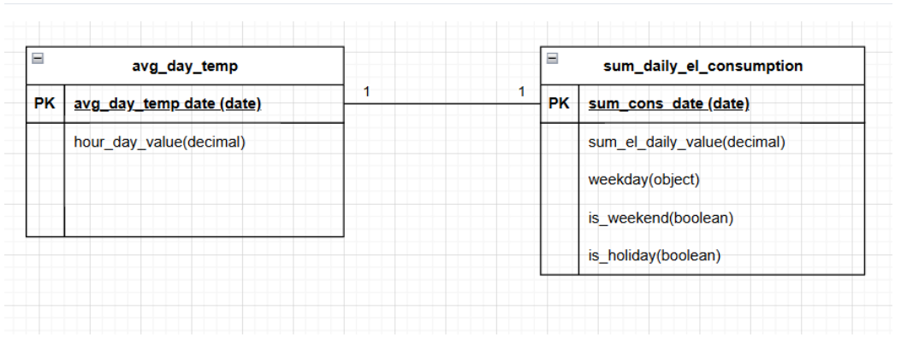

# Final Project: Electricity Consumption Forecast

## About the Final Project

- This is the final project of the **Vali-IT Data Analytics 6-week bootcamp**: [vali-it.ee/andmetarkus](https://vali-it.ee/andmetarkus)  
- **Tech stack**: Python, Jupyter Notebook, Visual Studio Code, Git, GitHub, Microsoft Power BI, Microsoft Excel  
- **Project authors**:  
  - Johannes Kauksi  
    - Email: johanneskauksi@gmail.com  
    - LinkedIn: [Johannes' linkedin](https://www.linkedin.com/in/johannes-kauksi/)
  - Sergei Erbin  
    - Email: sergei.erbin@gmail.com  
    - LinkedIn: [https://www.linkedin.com/in/sergei-erbin/](https://www.linkedin.com/in/sergei-erbin/)   
  - Tarmo Gede  
    - Email: tarmo.gede@gmail.com  
    - LinkedIn: https://www.linkedin.com/in/tarmo-gede/  

## Introduction of the Company and Research Problem  

Company X is an electricity sales company that needs **to forecast electricity consumption in Estonia at the hourly level** in order to support electricity planning and purchasing decisions.  

## Research plan

1. **Analyze correlation:** Examine the relationship between electricity consumption and temperature using historical data.
2. **Build forecast:** Develop an **hourly electricity consumption forecast model**.
3. **Validate:** Test the forecast **against actuals** and assess accuracy.

### 📌 Project Backlog

[View the backlog here](https://github.com/martinoland1/Electricity-Consumption-Forecast/blob/main/backlog.md)

## Business Glossary

| Business Term                       | Column name                  | Definition                                                                 | Source        | Calculation / Logic                                               | Unit |
|-------------------------------------|------------------------------|----------------------------------------------------------------------------|---------------|-------------------------------------------------------------------|------|
| Hourly electricity consumption      | `sum_el_hourly_value`        | Amount of electricity consumed during a specific hour.                      | Elering API   | Value provided by Elering API per hour.                           | MWh  |
| Daily electricity consumption       | `sum_el_daily_value`         | Total electricity consumed in a calendar day.                              | Elering API   | Sum of all 24 hourly values of the day.                           | MWh  |
| Hourly temperature                  | `hour_temp_value`            | Recorded air temperature for a specific hour.                              | Meteostat     | Meteostat hourly temperature value.                               | °C   |
| Average daily temperature           | `EE_avg_temp_C`              | The average temperature of all hours in a given day.                       | Meteostat     | Arithmetic mean of 24 hourly temperature values.                  | °C   |
| Weekday                             | `weekday`                    | Day of the week represented as a number (0–6).                             | Derived       | `weekday(sum_cons_date)` → 0=Monday, …, 6=Sunday.                 | 0–6  |
| Public holiday                      | `is_holiday`                 | Indicator whether the date is a public holiday.                            | Calendar      | Boolean value: `True` if the date matches the holiday calendar.   | —    |
| Hourly share of daily consumption   | `hour_day_value`             | Share of daily consumption attributed to a specific hour.                   | Derived       | `sum_el_hourly_value / sum_el_daily_value`.                       | %    |
| Model forecasted consumption        | `yhat_consumption`           | Electricity consumption predicted by the forecasting model.                 | Model         | Output of regression model.                                      | MWh  |
| Bias-adjusted forecast consumption  | `yhat_consumption_bias_adj`  | Forecast adjusted for systematic error (bias).                             | Model         | `yhat_consumption` plus bias correction or scaling adjustment.    | MWh  |

## Data Sources

- **Electricity Consumption**: [Elering API](https://dashboard.elering.ee/assets/swagger-ui/index.html)  
- **Temperature**: [Meteostat API](https://dev.meteostat.net/python/hourly.html)

## Data protection description – on what basis are the data processed?

The data are processed on the basis of publicly available open data.
No personal data are included, and the processing is carried out for research and analytical purposes.

## Data lineage

⚠️ Lisa "Temperature forecast" joonsele ⚠️

### Data Lineage Description  

The pipeline imports **electricity consumption data from Elering** and **weather data from Meteostat**, and merges them into a unified dataframe that serves as the central input for the forecasting process:

- **Regression analysis** captures the correlation between daily average temperature and electricity consumption.  
- **Bias correction** adjusts the regression output to reduce systematic errors (e.g., seasonal patterns or structural shifts).  
- **Weekday profiles** distribute daily consumption into hourly values, creating realistic load curves.  
- **Weather forecasts** are retrieved from Meteostat and used as future temperature inputs for the model.

The pipeline first generates a **daily forecast**, which is then disaggregated into an **hourly forecast** based on weekday and hourly patterns.  

## Data model

⚠️ Täienda data model ⚠️

## Data tables description

### Hourly & Daily Electricity Consumption DataFrames

#### Elering API
| Source System | Source Column | Python pipeline DataFrame column | Column Format | Description |
|---------------|---------------|----------------------------------|---------------|-------------|
| Elering API   | timestamp     | sum_cons_time                    | datetime (tz-aware, Europe/Tallinn) | Measurement time (hourly granularity) |
| Elering API   | consumption   | sum_el_hourly_value              | float (MWh)   | Hourly electricity consumption in MWh |

#### Hourly (get_hourly_consumption)
| Source System | Source Column | Python pipeline DataFrame column | Column Format                                    | Description |
|---------------|---------------|----------------------------------|--------------------------------------------------|-------------|
| Elering API   | timestamp     | sum_cons_time                    | datetime (tz-aware, Europe/Tallinn)              | Measurement time (hourly granularity) |
| Elering API   | consumption   | sum_el_hourly_value              | float (MWh)                                      | Hourly electricity consumption in MWh |
| — (derived)   | —             | imputed                          | boolean                                          | True, if value was filled by neighbor interpolation |
| — (derived)   | —             | weekday                          | string                                           | Day name (e.g., Monday, Tuesday) |
| — (derived)   | —             | is_weekend                       | boolean                                          | True if Saturday or Sunday |
| — (derived)   | —             | is_holiday                       | boolean                                          | True if Estonian public holiday |

#### Daily (get_daily_consumption)
| Source System | Source Column | Python pipeline DataFrame column | Column Format                               | Description |
|---------------|---------------|----------------------------------|---------------------------------------------|-------------|
| Aggregated    | —             | sum_cons_date                    | date (local, Europe/Tallinn)                | Local calendar day (aggregation bucket) |
| Aggregated    | —             | sum_el_daily_value               | float (MWh)                                  | Daily electricity consumption in MWh (sum of hourly values) |
| — (derived)   | —             | weekday                          | string                                       | Day name (e.g., Monday, Tuesday) |
| — (derived)   | —             | is_weekend                       | boolean                                      | True if Saturday or Sunday |
| — (derived)   | —             | is_holiday                       | boolean                                      | True if Estonian public holiday |

### Hourly & Daily Temperature DataFrames

#### Meteostat API
| Source System     | Source Column | Python pipeline DataFrame column | Column Format | Description |
|-------------------|---------------|----------------------------------|---------------|-------------|
| Meteostat API     | datetime      | hour_temp_time                   | datetime (tz-aware, Europe/Tallinn) | Measurement time (hourly granularity) |
| Meteostat API     | temp          | hour_temp_value                  | float (°C)    | Hourly average temperature across Estonian points |

#### Hourly (get_hourly_temperature)
| Source System | Source Column | Python pipeline DataFrame column | Column Format                                    | Description |
|---------------|---------------|----------------------------------|--------------------------------------------------|-------------|
| Meteostat API | datetime      | hour_temp_time                   | datetime (tz-aware, Europe/Tallinn)              | Measurement time (hourly granularity) |
| Meteostat API | temp          | hour_temp_value                  | float (°C)                                       | Hourly average temperature across selected Estonian points (Tallinn, Tartu, Pärnu, Narva, Kuressaare) |

#### Daily (get_daily_temperature)
| Source System | Source Column | Python pipeline DataFrame column | Column Format                               | Description |
|---------------|---------------|----------------------------------|---------------------------------------------|-------------|
| Aggregated    | —             | avg_day_temp_date                | date (local, Europe/Tallinn)                | Local calendar day (aggregation bucket) |
| Aggregated    | —             | hour_day_value                   | float (°C)                                  | Daily mean temperature (average of hourly values) |

### Joined Daily DataFrame and Regression Output Metrics

#### Joined Daily DataFrame (input for regression)
| Source System (join)        | Source Column                     | Python pipeline DataFrame column | Column Format               | Description |
|-----------------------------|-----------------------------------|----------------------------------|-----------------------------|-------------|
| Elering × Meteostat (daily) | sum_cons_date / avg_day_temp_date | sum_cons_date                    | date (Europe/Tallinn)       | Join key: local calendar date |
| Elering API (daily)         | sum_el_daily_value                | sum_el_daily_value               | float (MWh)                 | Daily electricity consumption (MWh) |
| Meteostat API (daily)       | hour_day_value                    | hour_day_value                   | float (°C)                  | Daily average temperature (°C) |
| Derived (flags)             | —                                 | is_weekend                       | boolean                     | True if the day is Saturday or Sunday |
| Derived (flags)             | —                                 | is_holiday                       | boolean                     | True if the day is an Estonian public holiday |

#### Regression Output Metrics (printed by the script)
| Field       | Column Format | Description |
|-------------|---------------|-------------|
| slope       | float         | Change in daily consumption per +1 °C (MWh/°C) |
| intercept   | float         | Expected daily consumption at 0 °C (MWh) |
| R           | float         | Pearson correlation coefficient between consumption and temperature |
| R²          | float         | Coefficient of determination – share of variance explained by the model |
| p-value     | float / N/A   | Statistical significance (if SciPy is available); otherwise “N/A” |
| RMSE        | float         | Root Mean Square Error (MWh) – average model error magnitude |
| MAE         | float         | Mean Absolute Error (MWh) |
| Rows used   | integer       | Number of rows included in regression |
| Date range  | date…date     | Local calendar period covered by the regression |

### Bias Analysis DataFrames (Daily, Monthly, Seasonal, Segmented)

#### Daily merged dataset (input for bias analysis)
| Source System (join)        | Source Column                     | Python pipeline DataFrame column | Column Format          | Description |
|-----------------------------|-----------------------------------|----------------------------------|------------------------|-------------|
| Elering × Meteostat (daily) | sum_cons_date / avg_day_temp_date | sum_cons_date                    | date                   | Local calendar date (join key) |
| Elering API (daily)         | sum_el_daily_value                | sum_el_daily_value               | float (MWh)            | Daily electricity consumption |
| Meteostat API (daily)       | hour_day_value                    | hour_day_value                   | float (°C)             | Daily average temperature |
| Derived                     | —                                 | is_weekend                       | boolean                | True if Saturday or Sunday |
| Derived                     | —                                 | is_holiday                       | boolean                | True if Estonian public holiday |
| Derived                     | —                                 | segment                          | string                 | “workday” or “offday” (weekend/holiday) |
| Regression model            | —                                 | y_hat                            | float (MWh)            | Predicted daily consumption (temp-only regression) |
| Regression model            | —                                 | resid                            | float (MWh)            | Residual (actual – predicted) |

#### Monthly aggregated dataset (from aggregate_monthly_bias)

| Source System | Source Column | Python pipeline DataFrame column | Column Format | Description |
|---------------|---------------|----------------------------------|---------------|-------------|
| Aggregated    | —             | month                            | datetime (month start) | Month bucket |
| Aggregated    | —             | actual                           | float (MWh)   | Monthly actual consumption (sum of daily values) |
| Aggregated    | —             | predicted                        | float (MWh)   | Monthly predicted consumption (sum of y_hat) |
| Derived       | —             | abs_error                        | float (MWh)   | Actual – predicted |
| Derived       | —             | pct_error                        | float         | Relative error (abs_error / actual) |
| Derived       | —             | bias_factor                      | float         | Actual / predicted |
| Derived       | —             | month_num                        | integer       | Month number (1–12) |
| Derived       | —             | season                           | string        | winter / spring / summer / autumn |

#### Bias factors (seasonal / monthly, segmented or not)

| Level            | Columns                          | Description |
|------------------|----------------------------------|-------------|
| Month-of-year    | month_num, avg_bias_factor, avg_pct_error, months, season | Average bias per calendar month across history |
| Season           | season, avg_bias_factor, months  | Average bias per season |
| Segmented (opt.) | segment, month_num/season, avg_bias_factor, avg_pct_error, months | Separate bias for workdays vs offdays |

### Next-7 days temperature forecast DataFrame (return of get_next7_forecast())

| Source System | Source Column | Python pipeline DataFrame column | Column Format                     | Description |
|---------------|---------------|----------------------------------|-----------------------------------|-------------|
| Meteostat API | datetime      | date_local (index)               | date (Europe/Tallinn, 7 rows)     | Local calendar day (D-resample from hourly forecast) |
| Meteostat API | temp          | Tallinn                          | float (°C)                        | Daily mean temperature for Tallinn (forecast) |
| Meteostat API | temp          | Tartu                            | float (°C)                        | Daily mean temperature for Tartu (forecast) |
| Meteostat API | temp          | Pärnu                            | float (°C)                        | Daily mean temperature for Pärnu (forecast) |
| Meteostat API | temp          | Narva                            | float (°C)                        | Daily mean temperature for Narva (forecast) |
| Meteostat API | temp          | Kuressaare                       | float (°C)                        | Daily mean temperature for Kuressaare (forecast) |
| Derived       | —             | EE_avg                           | float (°C)                        | Average across city columns per day |

### 7-Day Daily Electricity Consumption Forecast

| Python pipeline DataFrame column | Column Format                     | Description |
|----------------------------------|-----------------------------------|-------------|
| date_local                       | string (YYYY-MM-DD, Europe/Tallinn) | Local calendar date (forecast horizon: next 7 days starting tomorrow) |
| weekday                          | string                            | Day name (e.g., Monday) |
| is_weekend                       | boolean                           | True if Saturday or Sunday |
| is_holiday                       | boolean                           | True if Estonian public holiday |
| segment                          | string                            | Day class: "workday" or "offday" (weekend/holiday) |
| season                           | string                            | Season label: winter / spring / summer / autumn |
| month_num                        | integer (1–12)                    | Month number extracted from `date_local` |
| EE_avg_temp_C                    | float (°C)                        | Forecast daily mean temperature (Estonia average) |
| bias_key                         | string / int                      | Lookup key for bias factor (e.g., `workday:winter` or month number) |
| bias_factor                      | float                             | Applied bias multiplier for the day |
| yhat_base                        | float (MWh)                       | Temperature-only prediction: y = a + b·T |
| yhat_consumption                 | float (MWh)                       | Final forecast after bias adjustment (`yhat_base * bias_factor`) |

### Weekday Load Profiles and Daily-to-Hourly Forecast Split

#### Weekday Hourly Share Matrix (24×7)

| Column       | Column Format | Description |
|--------------|---------------|-------------|
| hour_local   | integer (0–23) | Local hour of day (Europe/Tallinn) |
| Monday…Sunday| float (0–1)    | Average share of daily consumption assigned to this hour for that weekday |

#### Days Used for Profile Calculation

| Column     | Column Format | Description |
|------------|---------------|-------------|
| weekday    | string        | Day name (Monday…Sunday) |
| date_local | date          | Calendar date (Europe/Tallinn) used in profile calculation |

#### Daily Forecast Split to Hourly

| Column             | Column Format                  | Description |
|--------------------|--------------------------------|-------------|
| datetime_local     | datetime (tz-aware, Europe/Tallinn) | Hour timestamp |
| weekday            | string                         | Day name (Monday…Sunday) |
| hour_local         | integer (0–23)                 | Hour of day |
| consumption_hourly | float (MWh)                    | Forecast hourly electricity consumption |

### 7-Day Hourly Electricity Consumption Forecast

| Column             | Column Format                     | Description |
|--------------------|-----------------------------------|-------------|
| datetime_local     | datetime (tz-aware, Europe/Tallinn) | Forecast timestamp for the hour |
| weekday            | string                            | Day name (Monday…Sunday) |
| hour_local         | integer (0–23)                    | Local hour of day |
| consumption_hourly | float (MWh)                       | Forecast hourly electricity consumption |
| date_local         | string (YYYY-MM-DD)               | Local calendar day (matches forecast horizon) |
| segment            | string (optional)                 | Workday/offday classification (if available from daily forecast) |
| season             | string (optional)                 | Season label: winter / spring / summer / autumn |
| is_weekend         | boolean (optional)                | True if Saturday or Sunday |
| is_holiday         | boolean (optional)                | True if Estonian public holiday |
| month_num          | integer (1–12, optional)          | Month number |
| EE_avg_temp_C      | float (°C, optional)              | Forecast daily mean temperature (Estonia average) |
| bias_key           | string/int (optional)             | Lookup key used for bias adjustment |
| bias_factor        | float (optional)                  | Bias multiplier applied |
| yhat_base          | float (MWh, optional)             | Base prediction before bias adjustment |
| yhat_consumption   | float (MWh, optional)             | Daily consumption forecast (bias-adjusted) carried from daily forecast |

## Power BI semantic model
⚠️ Lisada Power BI semantic model ⚠️

## Data quality check
⚠️ Lisada Data quality check ⚠️

## Exploratory data analysis
### 1. Yearly consumption and average temperature
This chart shows the total electricity consumption per year alongside the average air temperature.
- From 2020 to 2024, consumption remained relatively stable around 8 million MWh, while temperatures varied.
- The highest consumption was observed in 2021 (8.4M MWh).
- Data for 2025 is currently incomplete, showing a lower total (5.6M MWh).
- In general, colder years correspond with higher electricity usage.

### 2. Monthly consumption and temperature
This visualization illustrates the relationship between consumption and temperature on a monthly level.
- Winter months (December–February): higher consumption due to heating demand, with temperatures dropping below zero.
- Summer months (June–August): consumption decreases, while average temperatures peak at 16–19 °C.
- The inverse relationship is clear – colder months drive higher demand, warmer months lower demand.

### 3. Year-to-year comparison (2023 vs 2024)
This comparison highlights monthly consumption and temperatures across two consecutive years.
- Both years show the same seasonal pattern: higher demand in winter, lower in summer.
- Temperatures follow a similar curve, but January 2023 was colder than January 2024.
- The comparison suggests that even small differences in temperature (e.g., colder January) can cause significant changes in electricity demand.

### 4. Average consumption daily profile
Daily Consumption Profiles (by Day of the Week)
This visualization shows the average daily consumption patterns broken down by each day of the week.
- The chart highlights how electricity usage typically evolves hour by hour across weekdays and weekends:
- Workdays (Mon–Fri) follow a consistent pattern, with a clear morning peak (around 7–10 AM) and a gradual evening decline.
- Saturdays display a flatter profile, with less pronounced peaks, indicating more evenly distributed consumption throughout the day.
- Sundays show the lowest overall demand, especially during the morning hours, reflecting reduced industrial and commercial activity.
- This analysis provides insights into behavioral and operational differences between weekdays and weekends, which is essential for forecasting hourly demand and adjusting models for different calendar profiles.

## Statistical data analysis
### Regression Analysis (Daily Consumption vs. Temperature)
We fitted linear regression models to study the relationship between average daily temperature and electricity consumption in Estonia.
All Days: A strong negative correlation was observed between temperature and consumption. As temperature rises, electricity usage decreases, reflecting reduced heating demand. (Slope ≈ –395 MWh/°C, R² ≈ 0.75).
Workdays (Mon–Fri, non-holiday): The model shows an even stronger relationship (Slope ≈ –404 MWh/°C, R² ≈ 0.82), indicating that weekday consumption patterns are highly temperature-dependent.
Weekends & Holidays: The slope is slightly lower (≈ –382 MWh/°C, R² ≈ 0.81), but the correlation remains strong, showing that leisure days also follow the same inverse trend.
These models will later be integrated into the forecasting pipeline, where the segmented regressions (workdays vs. weekends/holidays) allow us to capture different behavioral patterns and improve accuracy in consumption prediction.

### Bias calculation
Seasonal Bias Correction Factors
To further refine forecasts, we computed bias correction factors by season (Spring, Summer, Autumn, Winter).
Spring (March–May) and Autumn (September–November): Transitional periods, where actual consumption often deviates from regression estimates due to rapid shifts in heating/cooling needs.
Winter (December–February): Highest bias adjustments, since cold extremes drive significantly higher electricity usage than predicted by a simple linear trend.
Summer (June–August): Lowest adjustments, as electricity consumption stabilizes and is less variable with temperature.
These factors are applied as multipliers to regression-based forecasts, either by season or by month, and can be segmented further into workdays vs. off-days.

### Weekday Load Profiles (24×7 Hourly Share Matrix)

We analyzed the average daily consumption patterns across weekdays by building a 24×7 share matrix. Each column (weekday) sums to 1.0, showing how electricity demand is distributed across the 24 hours of the day.
Key insights:
Early morning (0–5h): Lowest relative consumption across all weekdays (~3–3.5% of daily total per hour).
Morning ramp-up (6–9h): Sharp increase, peaking around 8–10h (up to ~5% of daily total per hour), especially on workdays.
Daytime plateau (10–16h): Stable, elevated demand throughout business hours.
Evening peak (18–21h): Second wave of demand, stronger on weekends, reflecting household activity.
Weekday vs Weekend: Weekdays show stronger morning peaks due to industrial and office usage, while weekends flatten daytime demand and shift load toward later hours.
This matrix is DST-aware and based on the Europe/Tallinn timezone, with public holidays excluded from the training sample. It is later used to adjust hourly forecast distributions once daily consumption is predicted.

## Model Accuracy Evaluation 

## Data story, conclusions
